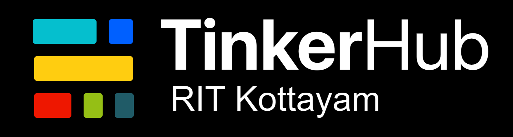

# TinkerHub RIT
Welcome to the official GitHub profile of TinkerHub RIT Kottayam! 🚀

## About Us

TinkerHub RIT Kottayam is a vibrant community of coders, developers, and tech enthusiasts from Rajiv Gandhi Institute of Technology, Kottayam. We are a group of passionate individuals who love to learn, build, and share knowledge about the latest in technology. Whether you're just starting out or are an experienced developer, our community is here to support you in your technical journey.

## Our Mission

Our mission is to create a collaborative environment where students can come together to:

Explore different fields of technology
Develop coding and problem-solving skills
Work on real-world projects and challenges
Participate in hackathons and coding competitions
Share knowledge through workshops, talks, and meetups

## What We Do

At TinkerHub RIT Kottayam, we focus on:

- **Learning Together**: We organize study groups, coding sessions, and workshops on various programming languages, tools, and technologies.
- **Building Projects**: We encourage hands-on learning by working on projects that solve real-world problems.
- **Community Support**: We provide a platform where members can ask questions, share resources, and collaborate on projects.
- **Hackathons and Competitions**: We participate in and host hackathons to challenge ourselves and showcase our skills.

## Join Us

Whether you're interested in coding, design, development, or simply want to be part of a community of like-minded individuals, TinkerHub RIT Kottayam has something for you. Join us, and let's tinker, learn, and build together!

## Connect with Us

Instagram: [@thinkerhub.rit](https://www.instagram.com/tinkerhub.rit/) 
LinkedIn: [tinkerhub-rit](https://www.linkedin.com/company/tinkerhub-rit) 
Mail Us: [tinkerhub@rit.ac.in](mailto:tinkerhub@rit.ac.in)

## Contributions
We welcome contributions from everyone. Feel free to check out our repositories and contribute to ongoing projects or start a new one!